# Diagram Sistem Ujian Online

Dokumen ini berisi diagram lengkap untuk sistem ujian online menggunakan Mermaid.js. 
Anda dapat menyalin kode diagram dan menjalankannya di https://mermaid.js.org/

## 1. Use Case Diagram

```mermaid
graph TB
    %% Actors
    Dosen[👨‍🏫 Dosen]
    Siswa[👨‍🎓 Siswa]
    System[🖥️ System]
    
    %% Use Cases - Dosen
    subgraph "Manajemen Ujian"
        UC1[Registrasi/Login Dosen]
        UC2[Buat Ujian Baru]
        UC3[Kelola Soal]
        UC4[Publikasi Ujian]
        UC5[Edit Password Ujian]
    end
    
    subgraph "Manajemen Siswa"
        UC6[Konfirmasi Aplikasi Siswa]
        UC7[Bulk Approval Siswa]
        UC8[Tolak Aplikasi Siswa]
    end
    
    subgraph "Monitoring & Penilaian"
        UC9[Monitor Ujian Real-time]
        UC10[Lihat Foto Pelanggaran]
        UC11[Nilai Esai Manual]
        UC12[Download Laporan PDF]
    end
    
    %% Use Cases - Siswa
    subgraph "Persiapan Ujian"
        UC13[Registrasi/Login Siswa]
        UC14[Edit Profil Siswa]
        UC15[Ajukan Ikut Ujian]
        UC16[Lihat Status Aplikasi]
    end
    
    subgraph "Pelaksanaan Ujian"
        UC17[Isi Identitas Peserta]
        UC18[Pemeriksaan Perangkat]
        UC19[Mulai Ujian]
        UC20[Kerjakan Soal]
        UC21[Submit Jawaban]
    end
    
    subgraph "Hasil & Riwayat"
        UC22[Lihat Hasil Ujian]
        UC23[Lihat Riwayat Ujian]
    end
    
    %% System Use Cases
    subgraph "Sistem Keamanan"
        UC24[Deteksi Pelanggaran]
        UC25[Capture Foto Violation]
        UC26[Fullscreen Monitoring]
        UC27[Anti-Cheat Detection]
        UC28[Auto Disqualification]
    end
    
    subgraph "Penilaian Otomatis"
        UC29[Hitung Nilai PG]
        UC30[Kombinasi Nilai Akhir]
        UC31[Generate Laporan]
    end
    
    %% Connections - Dosen
    Dosen --> UC1
    Dosen --> UC2
    Dosen --> UC3
    Dosen --> UC4
    Dosen --> UC5
    Dosen --> UC6
    Dosen --> UC7
    Dosen --> UC8
    Dosen --> UC9
    Dosen --> UC10
    Dosen --> UC11
    Dosen --> UC12
    
    %% Connections - Siswa
    Siswa --> UC13
    Siswa --> UC14
    Siswa --> UC15
    Siswa --> UC16
    Siswa --> UC17
    Siswa --> UC18
    Siswa --> UC19
    Siswa --> UC20
    Siswa --> UC21
    Siswa --> UC22
    Siswa --> UC23
    
    %% System Connections
    System --> UC24
    System --> UC25
    System --> UC26
    System --> UC27
    System --> UC28
    System --> UC29
    System --> UC30
    System --> UC31
    
    %% Dependencies
    UC2 -.-> UC3
    UC3 -.-> UC4
    UC15 -.-> UC6
    UC6 -.-> UC17
    UC17 -.-> UC18
    UC18 -.-> UC19
    UC19 -.-> UC20
    UC20 -.-> UC21
    UC20 -.-> UC24
    UC24 -.-> UC25
    UC21 -.-> UC29
    UC11 -.-> UC30
    UC29 -.-> UC30
    UC30 -.-> UC31
```

## 2. Activity Diagram - Proses Ujian Siswa

```mermaid
flowchart TD
    Start([🚀 Mulai]) --> Login{Login Siswa}
    Login -->|Belum Punya Akun| Register[📝 Registrasi Siswa]
    Register --> FillProfile[Isi Data Lengkap:<br/>- Nama, NIM, Jurusan<br/>- Username, Password<br/>- WhatsApp, Universitas]
    FillProfile --> ValidateData{Validasi Data}
    ValidateData -->|NIM/Username Duplikat| ShowError[❌ Tampilkan Error<br/>Data Sudah Terdaftar]
    ShowError --> FillProfile
    ValidateData -->|Valid| SaveProfile[💾 Simpan Profil]
    SaveProfile --> LoginSuccess
    
    Login -->|Sudah Punya Akun| LoginSuccess[✅ Login Berhasil]
    LoginSuccess --> Dashboard[📊 Dashboard Siswa]
    
    Dashboard --> CheckExams{Ada Ujian<br/>yang Disetujui?}
    CheckExams -->|Tidak| ApplyExam[📋 Ajukan Ikut Ujian]
    ApplyExam --> InputCode[Masukkan Kode Ujian]
    InputCode --> ValidateCode{Kode Valid?}
    ValidateCode -->|Tidak| ErrorCode[❌ Kode Tidak Valid]
    ErrorCode --> InputCode
    ValidateCode -->|Valid| CheckDuplicate{Sudah Pernah<br/>Ikut Ujian?}
    CheckDuplicate -->|Ya| ErrorDuplicate[❌ Sudah Pernah Ikut]
    ErrorDuplicate --> Dashboard
    CheckDuplicate -->|Tidak| CreateApplication[📝 Buat Aplikasi]
    CreateApplication --> WaitingRoom[⏳ Ruang Tunggu<br/>Status: Pending]
    
    WaitingRoom --> CheckApproval{Status Aplikasi}
    CheckApproval -->|Pending| WaitingRoom
    CheckApproval -->|Rejected| ShowRejected[❌ Aplikasi Ditolak]
    ShowRejected --> Dashboard
    CheckApproval -->|Approved| CheckExamTime{Waktu Ujian<br/>Sudah Dimulai?}
    
    CheckExams -->|Ya| CheckExamTime
    CheckExamTime -->|Belum| ShowWaiting[⏰ Ujian Belum Dimulai]
    ShowWaiting --> Dashboard
    CheckExamTime -->|Sudah Berakhir| ShowExpired[⏰ Ujian Sudah Berakhir]
    ShowExpired --> Dashboard
    CheckExamTime -->|Sedang Berlangsung| StartExam[🎯 Mulai Ujian]
    
    StartExam --> FillIdentity[📝 Isi Identitas Peserta:<br/>- Nama Lengkap<br/>- NIM<br/>- Program Studi<br/>- Kelas]
    FillIdentity --> DeviceCheck[🔍 Pemeriksaan Perangkat]
    
    DeviceCheck --> CheckDevice{Perangkat Valid?}
    CheckDevice -->|Mobile Device| BlockMobile[🚫 Blokir Mobile<br/>Hanya Desktop/Laptop]
    BlockMobile --> End([❌ Ujian Ditolak])
    CheckDevice -->|Multiple Screens| BlockMultiScreen[🚫 Blokir Multi-Screen<br/>Gunakan Satu Layar]
    BlockMultiScreen --> End
    CheckDevice -->|Camera Error| BlockCamera[🚫 Kamera Tidak Tersedia<br/>Izinkan Akses Kamera]
    BlockCamera --> End
    CheckDevice -->|Valid| RequestFullscreen[🖥️ Request Fullscreen]
    
    RequestFullscreen --> EnterFullscreen{Fullscreen<br/>Berhasil?}
    EnterFullscreen -->|Gagal| RetryFullscreen[🔄 Retry Fullscreen]
    RetryFullscreen --> EnterFullscreen
    EnterFullscreen -->|Berhasil| CreateSession[📋 Buat Sesi Ujian]
    
    CreateSession --> LoadQuestions[📚 Load Soal Ujian]
    LoadQuestions --> StartTimer[⏱️ Mulai Timer]
    StartTimer --> ShowExam[📝 Tampilkan Interface Ujian]
    
    ShowExam --> MonitoringActive[👁️ Aktivasi Monitoring:<br/>- Camera Capture<br/>- Fullscreen Lock<br/>- Tab Detection<br/>- Anti-Cheat]
    
    MonitoringActive --> AnswerQuestions[✏️ Kerjakan Soal]
    AnswerQuestions --> CheckViolation{Pelanggaran<br/>Terdeteksi?}
    CheckViolation -->|Ya| CapturePhoto[📸 Capture Foto Pelanggaran]
    CapturePhoto --> CountViolation[📊 Hitung Pelanggaran]
    CountViolation --> CheckViolationLimit{Pelanggaran >= 3?}
    CheckViolationLimit -->|Ya| AutoDisqualify[🚫 Auto Diskualifikasi]
    AutoDisqualify --> SaveSession[💾 Simpan Sesi<br/>Status: Disqualified]
    SaveSession --> ShowResult
    CheckViolationLimit -->|Tidak| ShowWarning[⚠️ Tampilkan Peringatan]
    ShowWarning --> AnswerQuestions
    CheckViolation -->|Tidak| AnswerQuestions
    
    AnswerQuestions --> CheckTime{Waktu Habis?}
    CheckTime -->|Ya| AutoSubmit[⏰ Auto Submit]
    CheckTime -->|Tidak| CheckFinish{Siswa Klik<br/>Selesai?}
    CheckFinish -->|Tidak| AnswerQuestions
    CheckFinish -->|Ya| CheckUnanswered{Ada Soal<br/>Belum Dijawab?}
    CheckUnanswered -->|Ya| ShowUnansweredWarning[⚠️ Peringatan Soal Kosong]
    ShowUnansweredWarning --> ConfirmSubmit{Tetap Submit?}
    ConfirmSubmit -->|Tidak| AnswerQuestions
    ConfirmSubmit -->|Ya| ManualSubmit[✅ Manual Submit]
    CheckUnanswered -->|Tidak| ManualSubmit
    
    AutoSubmit --> ProcessAnswers[⚙️ Proses Jawaban]
    ManualSubmit --> ProcessAnswers
    ProcessAnswers --> CalculateScore[🧮 Hitung Nilai:<br/>- PG: Otomatis<br/>- Essay: Menunggu Dosen]
    CalculateScore --> ExitFullscreen[🖥️ Keluar Fullscreen]
    ExitFullscreen --> UpdateSession[💾 Update Sesi<br/>Status: Finished]
    UpdateSession --> ShowResult[📊 Tampilkan Hasil]
    
    ShowResult --> BackToDashboard[🏠 Kembali ke Dashboard]
    BackToDashboard --> End([✅ Selesai])
    
    %% Styling
    classDef startEnd fill:#e1f5fe,stroke:#01579b,stroke-width:2px
    classDef process fill:#f3e5f5,stroke:#4a148c,stroke-width:2px
    classDef decision fill:#fff3e0,stroke:#e65100,stroke-width:2px
    classDef error fill:#ffebee,stroke:#c62828,stroke-width:2px
    classDef success fill:#e8f5e8,stroke:#2e7d32,stroke-width:2px
    
    class Start,End startEnd
    class Login,ValidateData,ValidateCode,CheckDuplicate,CheckApproval,CheckExamTime,CheckDevice,EnterFullscreen,CheckViolation,CheckViolationLimit,CheckTime,CheckFinish,CheckUnanswered,ConfirmSubmit decision
    class ShowError,ErrorCode,ErrorDuplicate,BlockMobile,BlockMultiScreen,BlockCamera,AutoDisqualify error
    class LoginSuccess,CreateApplication,CreateSession,ManualSubmit,ShowResult success
```

## 3. Activity Diagram - Proses Dosen

```mermaid
flowchart TD
    Start([🚀 Mulai]) --> Login{Login Dosen}
    Login -->|Belum Punya Akun| Register[📝 Registrasi Dosen]
    Register --> FillTeacherData[Isi Data Dosen:<br/>- Username<br/>- Password]
    FillTeacherData --> SaveTeacher[💾 Simpan Data Dosen]
    SaveTeacher --> LoginSuccess
    
    Login -->|Sudah Punya Akun| LoginSuccess[✅ Login Berhasil]
    LoginSuccess --> Dashboard[📊 Dashboard Dosen]
    
    Dashboard --> ChooseAction{Pilih Aksi}
    ChooseAction -->|Buat Ujian Baru| CreateExam[📝 Buat Ujian Baru]
    ChooseAction -->|Cari Ujian Existing| SearchExam[🔍 Cari Ujian]
    
    %% Create New Exam Flow
    CreateExam --> FillExamData[Isi Data Ujian:<br/>- Nama Ujian<br/>- Password Ujian<br/>- Waktu Mulai<br/>- Waktu Selesai]
    FillExamData --> ValidateExamData{Data Valid?}
    ValidateExamData -->|Tidak| ShowExamError[❌ Error Validasi]
    ShowExamError --> FillExamData
    ValidateExamData -->|Valid| GenerateCode[🎲 Generate Kode Ujian]
    GenerateCode --> SaveExam[💾 Simpan Ujian<br/>Status: Draft]
    SaveExam --> ManageQuestions[📚 Kelola Soal]
    
    %% Search Existing Exam Flow
    SearchExam --> InputExamCode[Masukkan Kode Ujian]
    InputExamCode --> ValidateCode{Kode Valid?}
    ValidateCode -->|Tidak| ShowCodeError[❌ Kode Tidak Ditemukan]
    ShowCodeError --> InputExamCode
    ValidateCode -->|Valid| InputPassword[Masukkan Password Ujian]
    InputPassword --> ValidatePassword{Password Benar?}
    ValidatePassword -->|Tidak| ShowPasswordError[❌ Password Salah]
    ShowPasswordError --> InputPassword
    ValidatePassword -->|Valid| ShowExamMenu[📋 Menu Ujian]
    
    %% Question Management
    ManageQuestions --> QuestionAction{Aksi Soal}
    QuestionAction -->|Tambah Soal| AddQuestion[➕ Tambah Soal]
    QuestionAction -->|Edit Soal| EditQuestion[✏️ Edit Soal]
    QuestionAction -->|Hapus Soal| DeleteQuestion[🗑️ Hapus Soal]
    QuestionAction -->|Publikasi| PublishExam[📢 Publikasi Ujian]
    
    AddQuestion --> ChooseQuestionType{Tipe Soal}
    ChooseQuestionType -->|Pilihan Ganda| CreateMC[📝 Buat Soal PG:<br/>- Pertanyaan<br/>- 4 Opsi Jawaban<br/>- Jawaban Benar]
    ChooseQuestionType -->|Esai| CreateEssay[📝 Buat Soal Esai:<br/>- Pertanyaan]
    CreateMC --> SaveQuestion[💾 Simpan Soal]
    CreateEssay --> SaveQuestion
    SaveQuestion --> ManageQuestions
    
    EditQuestion --> ModifyQuestion[✏️ Modifikasi Soal]
    ModifyQuestion --> UpdateQuestion[💾 Update Soal]
    UpdateQuestion --> ManageQuestions
    
    DeleteQuestion --> ConfirmDelete{Konfirmasi Hapus?}
    ConfirmDelete -->|Tidak| ManageQuestions
    ConfirmDelete -->|Ya| RemoveQuestion[🗑️ Hapus Soal]
    RemoveQuestion --> ManageQuestions
    
    PublishExam --> CheckQuestions{Ada Soal?}
    CheckQuestions -->|Tidak| ShowNoQuestionError[❌ Tidak Ada Soal<br/>Tambah Soal Dulu]
    ShowNoQuestionError --> ManageQuestions
    CheckQuestions -->|Ya| UpdateExamStatus[📢 Update Status: Published]
    UpdateExamStatus --> ShowExamMenu
    
    %% Exam Menu Actions
    ShowExamMenu --> ExamMenuAction{Pilih Menu}
    ExamMenuAction -->|Kelola Soal| ManageQuestions
    ExamMenuAction -->|Edit Password| EditPassword[🔐 Edit Password Ujian]
    ExamMenuAction -->|Konfirmasi Siswa| StudentConfirmation[👥 Konfirmasi Siswa]
    ExamMenuAction -->|Monitor Ujian| MonitorExam[👁️ Monitor Ujian]
    ExamMenuAction -->|Lihat Hasil| ViewResults[📊 Lihat Hasil]
    
    %% Edit Password
    EditPassword --> InputNewPassword[Masukkan Password Baru]
    InputNewPassword --> ValidateNewPassword{Password Valid?}
    ValidateNewPassword -->|Tidak| ShowPasswordValidationError[❌ Password Tidak Valid]
    ShowPasswordValidationError --> InputNewPassword
    ValidateNewPassword -->|Valid| UpdatePassword[💾 Update Password]
    UpdatePassword --> ShowPasswordSuccess[✅ Password Berhasil Diubah]
    ShowPasswordSuccess --> ShowExamMenu
    
    %% Student Confirmation
    StudentConfirmation --> LoadApplications[📋 Load Aplikasi Siswa]
    LoadApplications --> ShowApplications[👥 Tampilkan Daftar Aplikasi]
    ShowApplications --> ConfirmationAction{Aksi Konfirmasi}
    ConfirmationAction -->|Setujui Individual| ApproveIndividual[✅ Setujui Siswa]
    ConfirmationAction -->|Tolak Individual| RejectIndividual[❌ Tolak Siswa]
    ConfirmationAction -->|Bulk Approval| BulkApprove[✅ Setujui Massal]
    ConfirmationAction -->|Bulk Rejection| BulkReject[❌ Tolak Massal]
    ConfirmationAction -->|Kembali| ShowExamMenu
    
    ApproveIndividual --> UpdateApplicationStatus[💾 Update Status: Approved]
    RejectIndividual --> UpdateApplicationStatus2[💾 Update Status: Rejected]
    BulkApprove --> UpdateMultipleStatus[💾 Update Multiple Status: Approved]
    BulkReject --> UpdateMultipleStatus2[💾 Update Multiple Status: Rejected]
    UpdateApplicationStatus --> ShowApplications
    UpdateApplicationStatus2 --> ShowApplications
    UpdateMultipleStatus --> ShowBulkSuccess[✅ Bulk Approval Berhasil]
    UpdateMultipleStatus2 --> ShowBulkSuccess2[✅ Bulk Rejection Berhasil]
    ShowBulkSuccess --> ShowApplications
    ShowBulkSuccess2 --> ShowApplications
    
    %% Monitor Exam
    MonitorExam --> LoadSessions[📋 Load Sesi Ujian]
    LoadSessions --> ShowMonitoring[👁️ Dashboard Monitoring]
    ShowMonitoring --> MonitoringAction{Aksi Monitoring}
    MonitoringAction -->|Lihat Foto Pelanggaran| ViewViolationPhoto[📸 Lihat Foto Pelanggaran]
    MonitoringAction -->|Filter Siswa| FilterStudents[🔍 Filter/Cari Siswa]
    MonitoringAction -->|Refresh Data| RefreshMonitoring[🔄 Refresh Data]
    MonitoringAction -->|Kembali| ShowExamMenu
    
    ViewViolationPhoto --> ShowPhotoModal[🖼️ Tampilkan Modal Foto]
    ShowPhotoModal --> ShowMonitoring
    FilterStudents --> ShowFilteredResults[📋 Tampilkan Hasil Filter]
    ShowFilteredResults --> ShowMonitoring
    RefreshMonitoring --> LoadSessions
    
    %% View Results
    ViewResults --> LoadResults[📊 Load Hasil Ujian]
    LoadResults --> ShowResults[📋 Tampilkan Hasil]
    ShowResults --> ResultsAction{Aksi Hasil}
    ResultsAction -->|Nilai Esai| GradeEssay[📝 Nilai Esai]
    ResultsAction -->|Download PDF| DownloadPDF[📄 Download Laporan PDF]
    ResultsAction -->|Kembali| ShowExamMenu
    
    GradeEssay --> LoadEssayAnswers[📚 Load Jawaban Esai]
    LoadEssayAnswers --> ShowEssayGrading[📝 Interface Penilaian Esai]
    ShowEssayGrading --> InputEssayScore[Masukkan Nilai 0-100]
    InputEssayScore --> ValidateScore{Nilai Valid?}
    ValidateScore -->|Tidak| ShowScoreError[❌ Nilai Harus 0-100]
    ShowScoreError --> InputEssayScore
    ValidateScore -->|Valid| SaveEssayScore[💾 Simpan Nilai Esai]
    SaveEssayScore --> CalculateFinalScore[🧮 Hitung Nilai Akhir<br/>50% PG + 50% Esai]
    CalculateFinalScore --> ShowGradingSuccess[✅ Penilaian Berhasil]
    ShowGradingSuccess --> ShowResults
    
    DownloadPDF --> GeneratePDF[📄 Generate PDF Report]
    GeneratePDF --> ShowPDFSuccess[✅ PDF Berhasil Diunduh]
    ShowPDFSuccess --> ShowResults
    
    %% Back to Dashboard
    ShowExamMenu --> BackToDashboard{Kembali ke Dashboard?}
    BackToDashboard -->|Ya| Dashboard
    BackToDashboard -->|Tidak| ShowExamMenu
    
    Dashboard --> Logout{Logout?}
    Logout -->|Ya| End([👋 Selesai])
    Logout -->|Tidak| Dashboard
    
    %% Styling
    classDef startEnd fill:#e1f5fe,stroke:#01579b,stroke-width:2px
    classDef process fill:#f3e5f5,stroke:#4a148c,stroke-width:2px
    classDef decision fill:#fff3e0,stroke:#e65100,stroke-width:2px
    classDef error fill:#ffebee,stroke:#c62828,stroke-width:2px
    classDef success fill:#e8f5e8,stroke:#2e7d32,stroke-width:2px
    
    class Start,End startEnd
    class Login,ValidateExamData,ValidateCode,ValidatePassword,QuestionAction,ChooseQuestionType,ConfirmDelete,CheckQuestions,ExamMenuAction,ValidateNewPassword,ConfirmationAction,MonitoringAction,ResultsAction,ValidateScore,BackToDashboard,Logout decision
    class ShowExamError,ShowCodeError,ShowPasswordError,ShowNoQuestionError,ShowPasswordValidationError,ShowScoreError error
    class LoginSuccess,SaveExam,UpdateExamStatus,ShowPasswordSuccess,ShowBulkSuccess,ShowBulkSuccess2,ShowGradingSuccess,ShowPDFSuccess success
```

## 4. Conceptual Data Model (ERD)

## 5. Database Structure Diagram

```mermaid
graph TB
    subgraph "Firebase Firestore Structure"
        Root[artifacts/]
        App[ujian-online-app/]
        Public[public/]
        Data[data/]
        
        Root --> App
        App --> Public
        Public --> Data
        
        subgraph "Collections"
            Teachers[teachers/]
            Students[students/]
            Exams[exams/]
            
            Data --> Teachers
            Data --> Students
            Data --> Exams
        end
        
        subgraph "Teacher Document"
            TeacherDoc["{teacherId}"]
            TeacherFields["• username (string)<br/>• password (string)<br/>• createdAt (timestamp)<br/>• role (string)"]
            Teachers --> TeacherDoc
            TeacherDoc --> TeacherFields
        end
        
        subgraph "Student Document"
            StudentDoc["{studentId}"]
            StudentFields["• fullName (string)<br/>• nim (string)<br/>• username (string)<br/>• password (string)<br/>• major (string)<br/>• className (string)<br/>• university (string)<br/>• whatsapp (string)<br/>• createdAt (timestamp)<br/>• role (string)"]
            Students --> StudentDoc
            StudentDoc --> StudentFields
        end
        
        subgraph "Exam Document & Subcollections"
            ExamDoc["{examId}"]
            ExamFields["• teacherId (string)<br/>• name (string)<br/>• code (string)<br/>• password (string)<br/>• startTime (datetime)<br/>• endTime (datetime)<br/>• status (string)<br/>• createdAt (timestamp)"]
            
            Questions[questions/]
            Applications[applications/]
            Sessions[sessions/]
            
            Exams --> ExamDoc
            ExamDoc --> ExamFields
            ExamDoc --> Questions
            ExamDoc --> Applications
            ExamDoc --> Sessions
        end
        
        subgraph "Question Document"
            QuestionDoc["{questionId}"]
            QuestionFields["• text (string)<br/>• type (string)<br/>• options (array)<br/>• correctAnswer (number)"]
            Questions --> QuestionDoc
            QuestionDoc --> QuestionFields
        end
        
        subgraph "Application Document"
            ApplicationDoc["{applicationId}"]
            ApplicationFields["• studentId (string)<br/>• studentData (object)<br/>• examId (string)<br/>• examName (string)<br/>• status (string)<br/>• appliedAt (timestamp)"]
            Applications --> ApplicationDoc
            ApplicationDoc --> ApplicationFields
        end
        
        subgraph "Session Document"
            SessionDoc["{sessionId}"]
            SessionFields["• studentId (string)<br/>• studentInfo (object)<br/>• startTime (timestamp)<br/>• finishTime (timestamp)<br/>• status (string)<br/>• violations (number)<br/>• answers (object)<br/>• finalScore (number)<br/>• essayScores (object)<br/>• lastViolation (object)<br/>• violationSnapshot_1 (object)<br/>• violationSnapshot_2 (object)<br/>• violationSnapshot_3 (object)"]
            Sessions --> SessionDoc
            SessionDoc --> SessionFields
        end
    end
    
    %% Styling
    classDef collection fill:#e3f2fd,stroke:#1976d2,stroke-width:2px
    classDef document fill:#f3e5f5,stroke:#7b1fa2,stroke-width:2px
    classDef fields fill:#e8f5e8,stroke:#388e3c,stroke-width:2px
    
    class Teachers,Students,Exams,Questions,Applications,Sessions collection
    class TeacherDoc,StudentDoc,ExamDoc,QuestionDoc,ApplicationDoc,SessionDoc document
    class TeacherFields,StudentFields,ExamFields,QuestionFields,ApplicationFields,SessionFields fields
```

## 6. System Architecture Diagram

## Cara Menggunakan Diagram

1. **Salin kode diagram** yang ingin Anda lihat
2. **Buka** https://mermaid.js.org/
3. **Paste kode** di editor
4. **Klik "Render"** untuk melihat diagram
5. **Export** sebagai PNG/SVG jika diperlukan

## Keterangan Diagram

- **Use Case Diagram**: Menunjukkan semua fitur yang tersedia untuk Dosen, Siswa, dan System
- **Activity Diagram Siswa**: Alur lengkap dari registrasi hingga melihat hasil ujian
- **Activity Diagram Dosen**: Alur lengkap dari membuat ujian hingga penilaian
- **ERD**: Struktur database dan relasi antar tabel
- **Database Structure**: Struktur Firebase Firestore yang digunakan
- **System Architecture**: Arsitektur sistem secara keseluruhan

Semua diagram ini memberikan gambaran lengkap tentang sistem ujian online yang telah dibuat.